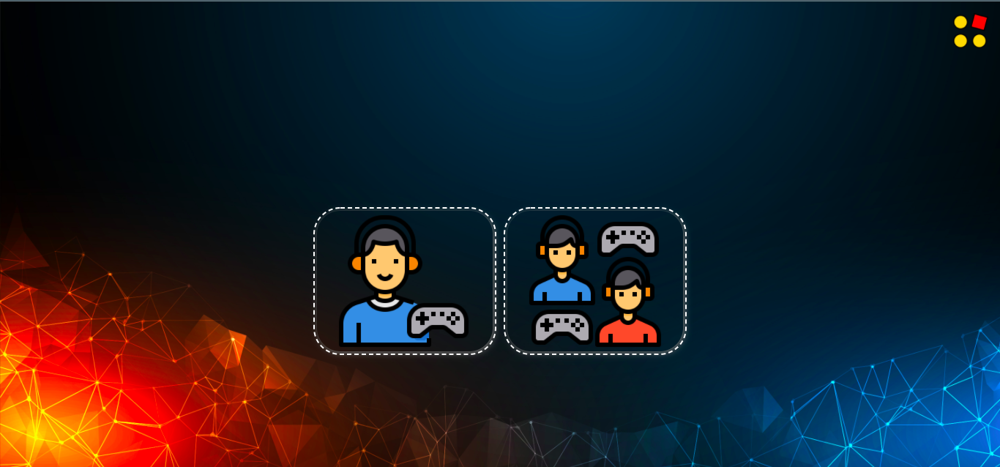
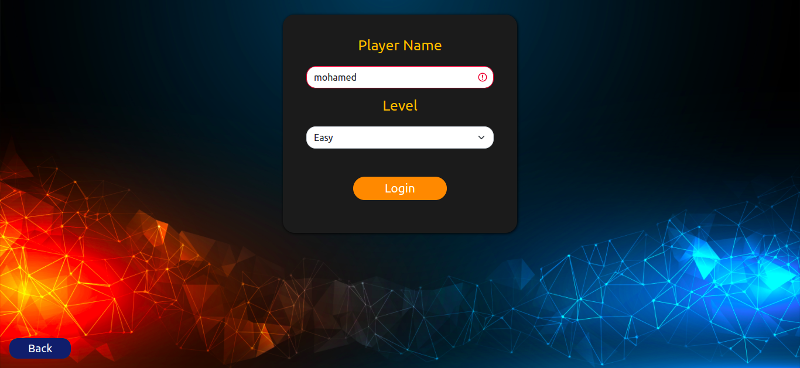
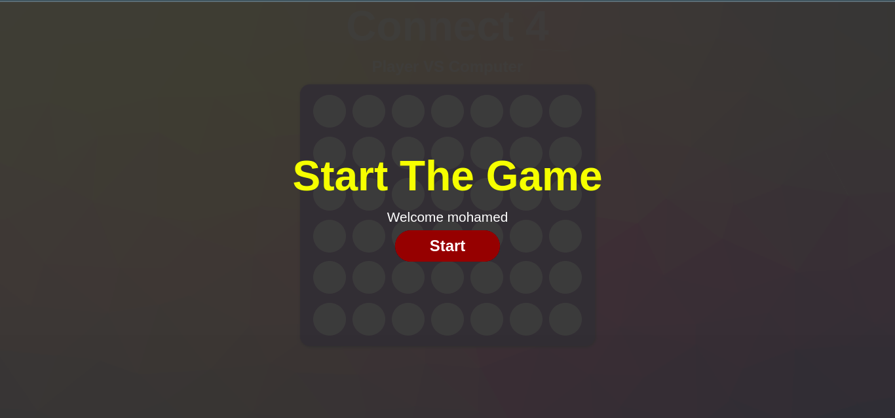
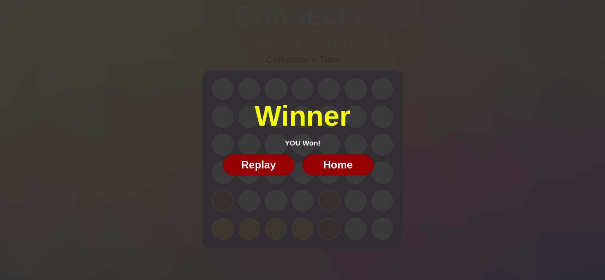
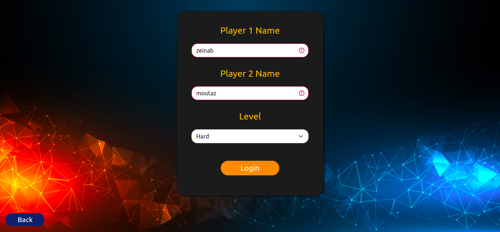
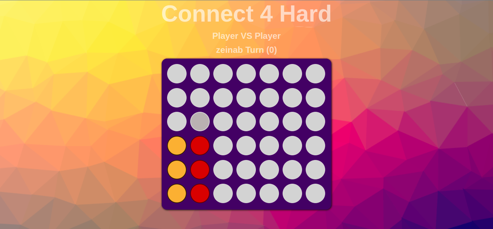

# Connect 4
## Connect 4 game using Javascript , Html and Css.

Connect Four is a two-player board game in which the players take turns dropping one colored disc from the top into a seven-column, six-row vertically suspended grid. The pieces fall straight down, occupying the lowest available space within the column. The objective of the game is to be the first to form:-
- a horizontal, vertical line of four of one's own discs in (easy level).
- a horizontal, vertical or diagonal line of five of one's own discs in (hard level).

## Features
- Two game moods (single Player or multi player).

- Two game levels (Easy or Hard)

## Screenshots

## Authors
- [Zainab Sabry](https://github.com/ZainabSabry)
- [Moutaz Mohamed](https://github.com/moutazmuhammad)
- [Mohamed Alaa](https://github.com/4mohamedalaa)
